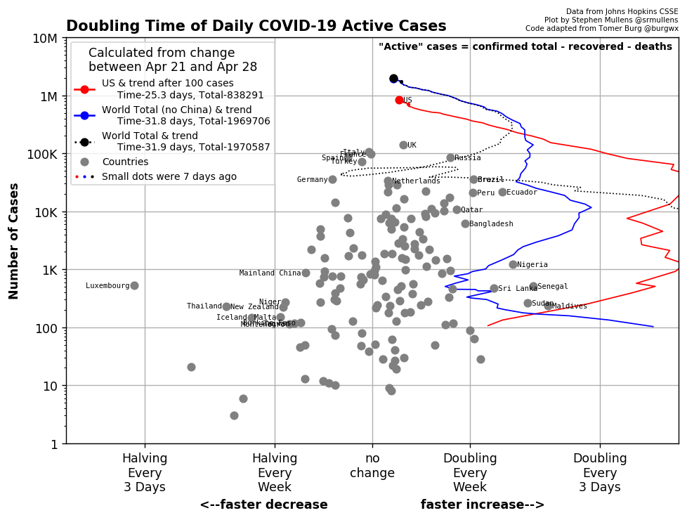

# COVID-19
Makes plots pertaining to the COVID-19 pandemic.

The code for these charts come from @tomerburg and his [COVID-19](https://github.com/tomerburg/COVID-19) repo. My code here heavily builds on his code, especially accessing and parsing the [Johns Hopkins CSSE data](https://github.com/CSSEGISandData/COVID-19).

## Example charts

### Doubling Rates

**plot_us_doubling.py** and **plot_world_doubling.py** produces charts like this one, which shows how many days it takes for cases to double or halve using an average of the last 7 days of data.

When plotting the doubling rate of cases, deaths, or recoveries, the chart only shows how fast these are increasing, since they cannot decrease. When specifically plotting the doubling rate of world deaths, labels indicate the maximum extent of past pandemics for comparison.

#### Features:
* Logarithmic y-axis has shortened labels.
* The logarithmic y-axis adjusts automatically to the next order of magnitude as amounts increase.
* The referenced vertical gridlines adusts automatically depending on the range of doubling rates in the data.
* Country labels show:
  * The 5 countries with the most cases.
  * The 10 countries with the highest doubling rates.
  * For active cases, the same as above, but for "halving rates."
* US doubling rates show 2-letter state abbreviations instead of dots, with the following additions:
  * DC = Washington D.C.
  * VI = Virgin Islands
  * PR = Puerto Rico

### Charts

**plot_us_chart.py** and **plot_world_chart.py** produces charts like this one, which shows the number of active worldwide cases. Note: My code here is merely a personal customization of code by @tomerburg.

